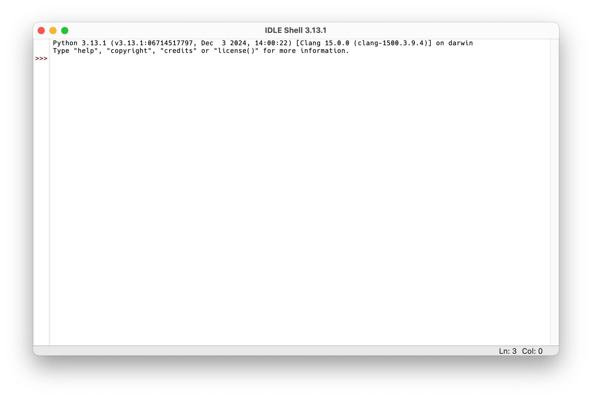
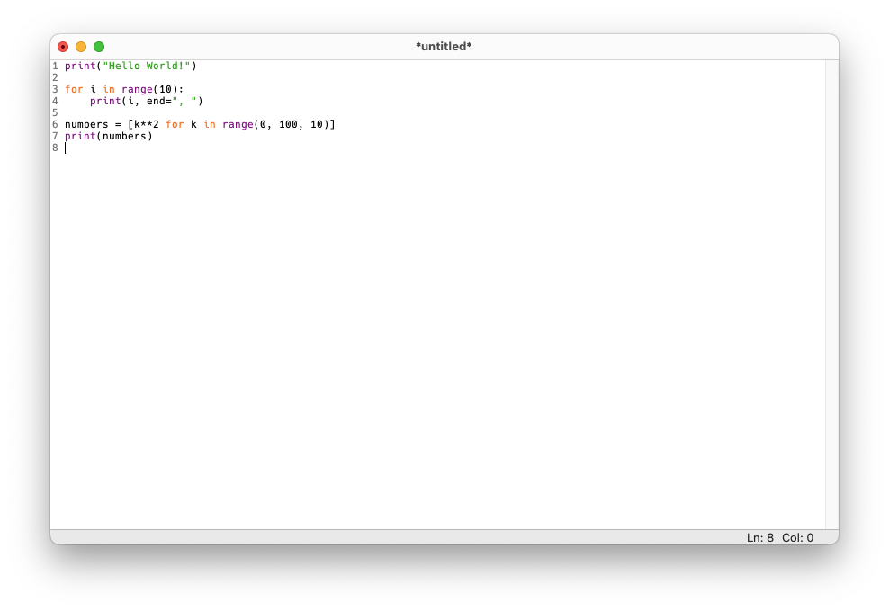
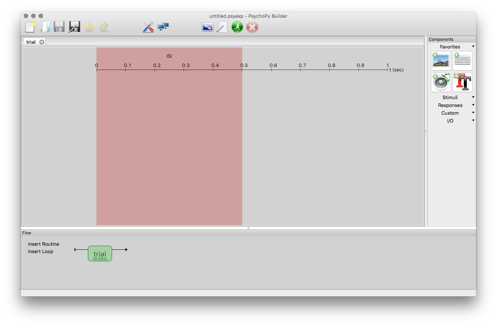
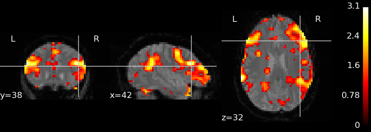
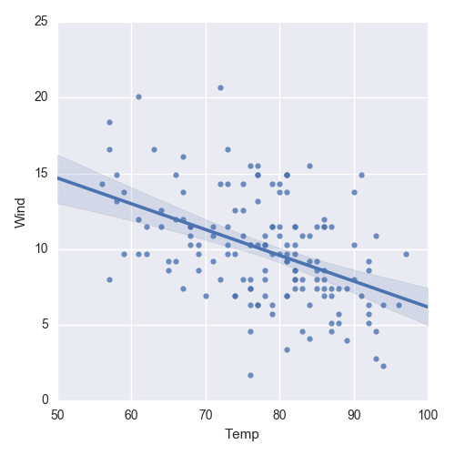

## Überblick

Dieser Kurs vermittelt die Grundlagen der Programmiersprache [Python](https://www.python.org/). Zunächst werden die wichtigsten Elemente der Sprache wie Schleifen, Bedingungen, Funktionen, und häufig verwendete Datentypen vorgestellt. Nach einer ausführlichen Behandlung dieser Grundlagen lernen Sie auch, wie man Python für die Datenanalyse verwenden kann. Dabei werden essentielle Themen wie das Installieren von Zusatzpaketen, das Arbeiten mit numerischen Daten und das Erstellen einfacher Grafiken behandelt. Abschließend werden Sie mit dem in der Psychologie populären Python-Paket [PsychoPy](https://www.psychopy.org) einfache Experimente erstellen.

Für diesen Kurs sind keinerlei Vorkenntnisse erforderlich. Sie werden das Programmieren anhand praktischer Beispiele erlernen und können dieses Wissen anschließend auf die meisten anderen Programmiersprachen übertragen. Aufgrund der begrenzten Zeit werden nur die wichtigsten Python-Konzepte behandelt, aber diese bilden die Basis für alle weiterführenden Anwendungen. Sie werden somit ein solides Wissen über diese Grundlagen erwerben, um anschließend selbständig weiterführende Methoden zu erlernen.


## Was ist Python?

Python ist eine universelle Programmiersprache, welche in vielen verschiedenen Anwendungsgebieten eingesetzt werden kann. Im Gegensatz dazu gibt es spezialisierte Programmiersprachen (wie z.B. [R](https://www.r-project.org/)), welche für sehr spezifische Aufgaben entwickelt wurden. Beide Ansätze haben Vor- und Nachteile: Spezialisierte Programmiersprachen erlauben es oft, bestimmte Aufgaben schneller, besser oder eleganter zu lösen als universelle Programmiersprachen. Universelle Programmiersprachen sind dafür vielseitiger einsetzbar, was auch den Vorteil hat, dass man nicht unbedingt mehrere Programmiersprachen erlernen muss. Python deckt nicht nur Datenanalyse und Statistik ab, sondern auch komplett andere Anwendungen wie z.B. Webapplikationen, das Erstellen von Programmen mit grafischen Benutzeroberflächen oder auch das Programmieren des [Raspberry Pi](https://www.raspberrypi.org/).

Wichtig ist auf jeden Fall, dass man sich vorher überlegt, welche Programmiersprache für ein gegebenes Problem geeignet ist, denn es gibt keine "beste" Programmiersprache, die für alle Anwendungsfälle optimal ist.

, CC BY-NC 2.5](python-xkcd.png){fig-align="left"}

Python wird oft mit den folgenden Eigenschaften beschrieben:

- Einfach und elegant
- [Open Source](https://de.wikipedia.org/wiki/Open_Source) (nicht nur gratis, sondern auch offen, da der [Quellcode](https://github.com/python/cpython) frei verfügbar ist)
- [Plattformübergreifend](https://de.wikipedia.org/wiki/Plattformunabh%C3%A4ngigkeit) (läuft auf Windows, macOS und Linux)
- Universelle Programmiersprache mit vielen Anwendungsgebieten
- Umfangreiche [Standardbibliothek](https://docs.python.org/3/library/), welche viele nützliche Funktionen und Werkzeuge enthält und direkt mit Python mitgeliefert wird
- Extrem viele [Zusatzpakete](https://pypi.org/), die weitere Funktionalität bereitstellen
- Riesige und aktive Community


## Popularität

Python wurde bereits 1991 von [Guido van Rossum](https://de.wikipedia.org/wiki/Guido_van_Rossum) veröffentlicht und hat gerade in den letzten Jahren enorm an Popularität gewonnen. Bereits seit einiger Zeit ist Python die beliebteste bzw. meistverwendete Programmiersprache weltweit (siehe beispielsweise [PYPL](https://pypl.github.io/PYPL.html), [TIOBE](https://www.tiobe.com/tiobe-index/) und [IEEE Spectrum Top Programming Languages](https://spectrum.ieee.org/top-programming-languages-2024)). Außerdem zeigt die [Stack Overflow Developer Survey 2025](https://survey.stackoverflow.co/2025/), dass Python nach wie vor [sehr stark wächst](https://survey.stackoverflow.co/2025/technology#most-popular-technologies) und [sehr gefragt ist](https://survey.stackoverflow.co/2025/technology#2-programming-scripting-and-markup-languages). 

In der Praxis ist die Popularität einer Programmiersprache durchaus relevant, denn je größer und aktiver die Community einer Sprache ist, desto einfacher wird es, bestehende Lösungen für Probleme zu finden oder Antworten auf neue Fragen zu bekommen.


## Wie sieht Python-Code aus?

Im Folgenden sehen Sie einige Beispiele für Python-Code. Manche Befehle sind vielleicht intuitiv verständlich, andere wiederum können durchaus verwirrend wirken. Alle Beispiele werden aber im Laufe der Lehrveranstaltung erklärt, im Moment sollen diese nur der Veranschaulichung dienen.

Die grauen Kästchen zeigen Python-Befehle, unmittelbar darunter folgt das Ergebnis des jeweiligen Befehls.

```{python}
print("Hello World!")
```

```{python}
"only lowercase letters".upper()
```

```{python}
for i in range(10):
    print(i, end=", ")
```

```{python}
print(", ".join([str(i) for i in range(10)]))
```

```{python}
[k**2 for k in range(0, 100, 10)]
```


## Installation

Die [offizielle Python-Website](https://www.python.org/) bietet zahlreiche Informationen rund um Python. Im [Download-Bereich](https://www.python.org/downloads/) stehen Installationspakete für Windows und macOS bereit (unter Windows wird der Python Install Manager installiert, der auch im [Microsoft Store](https://apps.microsoft.com/detail/9NQ7512CXL7T) erhältlich ist). Hinweise zur Verwendung von Python unter Windows und macOS finden Sie jeweils in der [Dokumentation für Windows](https://docs.python.org/3/using/windows.html) und der [Dokumentation für macOS](https://docs.python.org/3/using/mac.html). Bei den meisten Linux-Distributionen ist Python bereits vorinstalliert; andernfalls lässt es sich unkompliziert über den Paketmanager der jeweiligen Distribution installieren.


## Erste Schritte

Nachdem Sie Python installiert haben, können Sie den sogenannten *Python-Interpreter* starten. Dabei handelt es sich um ein Programm, welches Python-Befehle verstehen und verarbeiten kann. Man kann mit dem Python-Interpreter auch interaktiv arbeiten. Dies bedeutet, dass man einen Befehl eintippt und mit der Eingabetaste bestätigt. Danach wird der eingegebene Befehl direkt verarbeitet und das Ergebnis ausgegeben.

Es gibt viele Möglichkeiten, den Python-Interpreter zu starten. Eine der einfachsten Methoden ist die Verwendung von [IDLE](https://docs.python.org/3/library/idle.html), einer einfachen Lernumgebung für Python, die mit der Python-Installation mitgeliefert wird. Nach dem Start von IDLE öffnet sich ein Fenster mit dem Titel *IDLE Shell*, in dem der interaktive Python-Interpreter läuft. Ein sogenannter *Prompt* (die Symbole `>>>`) zeigt an, dass der Interpreter bereit für Eingaben ist. Hier können wir also einen Python-Befehl eingeben und mit der Eingabetaste bestätigen. Der Interpreter verarbeitet den Befehl und gibt das Ergebnis (falls vorhanden) in der nächsten Zeile aus.

{width=75%}

::: callout-note
In den Kursunterlagen wird Python-Code immer in grauen Kästchen dargestellt. Der Prompt `>>>` wird dabei weggelassen, da er nicht Teil des Codes ist.
:::

Versuchen wir nun, mit Python einfache arithmetische Aufgaben zu lösen. Die Symbole für die vier Grundrechenarten sind `+` (Addition), `-` (Subtraktion), `*` (Multiplikation) und `/` (Division). Tippen Sie dazu die folgenden Befehle in die IDLE-Shell ein und bestätigen Sie jeweils mit der Eingabetaste:

```{python}
1 + 1
```

```{python}
10 - 7
```

```{python}
7 * 8
```

```{python}
120 / 7
```

::: callout-tip
Aus Gründen der besseren Lesbarkeit sollten Leerzeichen vor und nach einem Operator eingefügt werden, also besser `10 - 7` und nicht `10-7`. Für Python ist zwar beides korrekt, aber die erste Variante ist leichter lesbar.
:::

::: callout-important
Beachten Sie, dass Python die *englische* Zahlenschreibweise mit einem *Punkt* als Dezimaltrennzeichen verwendet und nicht das im deutschen Sprachraum übliche *Komma*. Dezimalzahlen müssen daher immer mit einem Punkt eingegeben werden, ganz egal welche Sprache im Betriebssystem eingestellt ist.
:::

Die ganzzahlige Division hat einen eigenen Operator `//`, der aus zwei Zeichen besteht:

```{python}
120 // 7
```

Der ganzzahlige Rest einer Division wird mit dem Rest-Operator `%` berechnet:

```{python}
120 % 7
```

Potenzieren (also eine Zahl hoch eine andere Zahl) ist ebenso möglich:

```{python}
2**64
```

Python kennt die Vorrangs- und Klammerregeln:

```{python}
(13 + 6) * 8 - 12 / (2.5 + 1.6)
```

Wenn man mathematische Funktionen wie beispielsweise Sinus oder Kosinus verwenden möchte, muss man zuerst das `math`-Modul importieren (aktivieren). Dazu tippt man den folgenden Befehl ein:

```{python}
import math
```

Danach kann man eine Vielzahl an mathematischen Funktionen und Konstanten verwenden, z.B. `sqrt` (Quadratwurzel), `log` (Logarithmus), `sin` (Sinus), `cos` (Kosinus) sowie Konstanten wie `pi` (die [Kreiszahl $\pi$](https://de.wikipedia.org/wiki/Kreiszahl)) oder `e` ([Eulersche Zahl](https://de.wikipedia.org/wiki/Eulersche_Zahl)).

Wichtig ist, dass diese Funktionen und Konstanten immer mit einem vorangestellten `math.` verwendet werden müssen:

```{python}
math.sqrt(2)
```

```{python}
math.pi
```

```{python}
math.e
```

```{python}
1 + math.sqrt(5) * 7 - 2 * math.pi * 1.222
```

::: callout-tip
In Python ist es notwendig, Module zu *importieren*, um deren Funktionen und Variablen verwenden zu können. Wir werden im Laufe dieses Kurses viele verschiedene Module importieren und verwenden.
:::


## Skripte

Der interaktive Interpreter ist ideal, um einzelne Befehle auszuprobieren und sofort das Ergebnis zu sehen. Allerdings speichert er den eingegebenen Code nicht – startet man IDLE neu, sind alle vorherigen Eingaben verloren.

Um Code dauerhaft zu speichern, schreibt man ihn in eine Textdatei mit der Endung `.py` (solche Dateien nennt man *Python-Skripte* oder *Python-Programme*). IDLE bietet dafür einen einfachen Texteditor. Um ein neues Skript zu erstellen, wählt man im Menü "File" > "New File". Es öffnet sich ein Editor-Fenster, in dem man Python-Code schreiben und mit "File" > "Save" in eine `.py`-Datei speichern kann.



Um das gesamte Skript auszuführen, wählt man im Menü "Run" > "Run Module" (oder drückt <kbd>F5</kbd>). Das Skript wird dann von Anfang bis Ende ausgeführt.

Ein wichtiger Unterschied zum interaktiven Modus: Im Skript-Modus zeigt Python die Ergebnisse *nicht* automatisch an. Angenommen, ein Skript enthält die folgende Zeile:

```python
1 + 4
```

Führt man dieses Skript aus, wird der Befehl zwar ausgeführt, aber es erscheint keine Ausgabe. Das ist durchaus beabsichtigt, weil ein Skript oft viele Befehle enthält und man nicht jedes Zwischenergebnis sehen will. Möchte man ein Ergebnis im Skript-Modus ausgeben, muss man das explizit mit der `print`-Funktion tun:

```python
print(1 + 4)
```

::: callout-tip
Jedes Python-Programm beginnt immer "bei Null", d.h. beim Ausführen sind keine Ergebnisse aus früheren Sitzungen vorhanden. Das ist sinnvoll, da es dazu beiträgt, reproduzierbaren Code zu schreiben.
:::


## Terminal und Interpreter

Neben der IDLE-Shell gibt es noch ein weiteres wichtiges Programm, das wir im Lauf des Kurses verwenden werden: das *Terminal*. Es ist wichtig, das Terminal *nicht* mit dem Python-Interpreter zu verwechseln.

- In der **IDLE-Shell** (bzw. im Python-Interpreter) tippt man *Python-Befehle* ein (z.B. `1 + 1` oder `import math`).
- Im **Terminal** läuft *kein* Python, sondern eine sogenannte [Shell](https://de.wikipedia.org/wiki/Shell_(Betriebssystem)). Hier tippt man *Shell-Befehle* ein, um z.B. Programme zu starten oder Dateien zu verwalten.

Wir werden den Python-Interpreter in diesem Kurs hauptsächlich innerhalb von IDLE verwenden. Das Terminal benötigen wir später, um Zusatzpakete zu installieren (mehr dazu in einer späteren Einheit).


## Anwendungsbeispiele

Python wird heutzutage in vielen verschiedenen Bereichen verwendet. Um zu verdeutlichen, wie vielfältig man Python vor allem in der Forschung einsetzen kann, sind hier einige relevante Beispiele angeführt. Diese Auswahl ist jedoch bei weitem nicht vollständig und spiegelt vor allem meine persönliche Erfahrung wider.


### Präsentation von Stimuli

[PsychoPy](http://www.psychopy.org/) ist ein Programm zur Präsentation von Stimuli für psychophysiologische Untersuchungen. Beispielsweise kann man mit PsychoPy Experimente erstellen, um Reaktionszeiten zu messen. Das Programm kann aber auch für fMRI- bzw. EEG-Untersuchungen verwendet werden, um die dort benötigten (visuellen bzw. auditorischen) Stimuli zeitpräzise zu präsentieren. PsychoPy kann über eine grafische Oberfläche bedient werden, aber spezielle Versuchsdesigns, die über die mitgelieferten Standardparadigmen hinausgehen, erstellt man am besten direkt mit Python-Code. Wir werden uns in den letzten beiden Einheiten mit PsychoPy beschäftigen.

{width=75%}


### Neurowissenschaften

Python ist sehr populär in den Neurowissenschaften. Auf der [NIPY-Website](https://nipy.org/) (Neuroimaging for Python) haben sich einzelne Projekte zusammengeschlossen, welche spezifische Aufgaben im Bereich der Neurowissenschaften abdecken. Besonders viele Pakete gibt es für die Auswertung von [fMRT](https://de.wikipedia.org/wiki/Funktionelle_Magnetresonanztomographie)-Daten. Hier gibt es z.B. [NiBabel](https://nipy.org/nibabel/) zum Einlesen verschiedenster Neuroimaging-Datenformate, [Nipype](https://www.mit.edu/~satra/nipype-nightly/) zur einheitlichen Verwendung unterschiedlicher fMRT-Analyseprogramme, sowie [NIPY](https://nipy.org/nipy/), [NiTime](https://nipy.org/nitime/) und [Nilearn](https://nilearn.github.io/) zur Analyse von fMRT-Daten.



[MNE-Python](https://mne.tools/) kann man zur Analyse von [EEG](https://de.wikipedia.org/wiki/Elektroenzephalografie)- bzw. [MEG](https://de.wikipedia.org/wiki/Magnetoenzephalographie)-Signalen verwenden. Es werden eine Vielzahl an Methoden unterstützt, welche in der Verarbeitung von elektrophysiologischen Gehirnsignalen eine Rolle spielen, wie z.B. Filterung, Artefaktbereinigung, Quelllokalisation und Konnektivitätsanalysen. Es gibt auch eine grafische Oberfläche names [MNELAB](https://github.com/cbrnr/mnelab).


### Statistische Datenanalyse

Zur statistischen Auswertung von Daten gibt es in Python ebenfalls eine große Anzahl an Paketen. Besonders hervorzuheben sind hier [NumPy](https://www.numpy.org/), [SciPy](https://scipy.org/), [Polars](https://www.pola.rs/), [pandas](https://pandas.pydata.org/), [statsmodels](https://www.statsmodels.org/stable/index.html), [Matplotlib](https://matplotlib.org/), [seaborn](https://seaborn.pydata.org/) und [scikit-learn](https://scikit-learn.org/stable/). Einige dieser Pakete werden wir im Rahmen dieses Kurses kennenlernen (wenn auch nur sehr oberflächlich).




## Übungen

### Übung 1

Installieren Sie Python auf Ihrem Rechner. Starten Sie dann den Python-Interpreter. Welche Version von Python meldet der Interpreter? Ist dies die aktuellste Version?


### Übung 2

Tippen Sie im Python-Interpreter `import antigravity` ein. Was passiert? Was geschieht, wenn Sie `import this` eingeben? Was bewirkt `import math`?


### Übung 3

Die Erde kann näherungsweise als Kugel mit einem Radius von 6371 km betrachtet werden. Berechnen Sie damit die Oberfläche der Erde! Die Formel für die Oberfläche $A$ einer Kugel mit Radius $r$ lautet:

$$A = 4 \pi r^2$$


### Übung 4

Gegeben seien folgende Messwerte: 11, 27, 15, 10, 33, 18, 25, 22, 39, 11. Berechnen Sie den arithmetischen sowie den geometrischen Mittelwert (unter Verwendung von Grundrechenarten). Führen Sie die Berechnung mit jeweils einem einzigen Befehl (ohne Zwischenergebnisse) durch.

Die Formeln für den arithmetischen bzw. geometrischen Mittelwert lauten:

$$\bar x = \frac{1}{n} \sum_{i=1}^n x_i$$

$$\bar x_g = \sqrt[n]{\prod_{i=1}^n x_i}$$

::: callout-note
Die *n*-te Wurzel kann man auch als Potenz anschreiben, also $\sqrt[n]{x}$ ist gleichbedeutend mit $x^\frac{1}{n}$.
:::


### Übung 5

Berechnen Sie das Ergebnis des folgenden Ausdrucks mit einem Befehl (in einer Zeile):

$$\frac{(5^5 - \pi) \cdot \frac{19}{3}}{\sqrt{13} + 7^\frac{2}{3}}$$

::: callout-note
Achten Sie auf die Klammersetzung! Das richtige Ergebnis beträgt ungefähr 2722.
:::


### Übung 6

Warum funktioniert der folgende Befehl nicht (unter der Annahme, dass vorher `import math` ausgeführt wurde)?

```python
math.Sqrt(4)
```


## Lösungen

Die Lösungen zu diesen Übungen finden Sie [hier](01-solutions.qmd).
