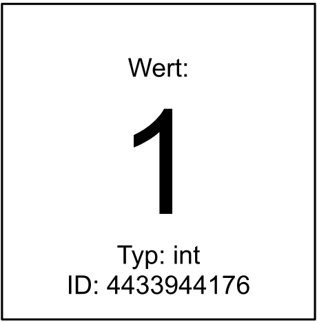

## Objekte, Werte und Typen

Alles in Python ist ein *Objekt*. Ein Objekt hat einen bestimmten Wert, z.B.

```{python}
1
```

```{python}
2.15
```

```{python}
"Hallo"
```

```{python}
"3"
```

::: callout-tip
Zur Erinnerung: Python gibt im interaktiven Modus Werte automatisch aus.
:::

Jedes Objekt hat neben einem Wert auch einen bestimmten Typ. Mit `type` kann man den Typ eines beliebigen Objekts herausfinden:

```{python}
type(1)
```

```{python}
type(2.15)
```

```{python}
type("Hallo")
```

```{python}
type("3")
```

Man kann sich ein Objekt als eine Entität eines bestimmten Typs vorstellen, die einen bestimmten Wert hat und im Speicher des Computers lebt:

{width=20%}

Jedes Objekt hat auch einen eindeutigen Identifikator (ID). Mit der Funktion `id` kann man diesen herausfinden:

```{python}
id(3)
```

```{python}
id(4)
```

Die tatsächlichen Identifikationsnummern sind irrelevant (und von Sitzung zu Sitzung unterschiedlich). Es ist nur wichtig, ob zwei Identifikationsnummern in einer laufenden Python-Sitzung identisch sind oder nicht. Im vorherigen Beispiel hat das Objekt `3` eine andere ID als das Objekt `4`, daher wissen wir, dass dies zwei verschiedene Objekte sind.


## Namen

Namen in Python sind nichts anderes als Namen für bestimmte Objekte (in anderen Programmiersprachen werden Namen meistens als Variablen bezeichnet). Mit dem Zuweisungsoperator `=` können wir einem Objekt einen Namen geben:

```{python}
a = 1
```

Einen Namen kann man sich als Etikett vorstellen, das an ein Objekt gehängt wird:

{width=75%}

In Python kann man einen existierenden Namen jederzeit einem anderen Objekt zuweisen. Dabei verliert der Name seine Verbindung zum alten Objekt (im folgenden Beispiel hat das Objekt `1` danach keinen Namen mehr):

```{python}
a = 2.4
```

{width=75%}

Ein Objekt kann auch mehr als einen Namen haben:

```{python}
b = a
```

{width=75%}

Wir können bestätigen, dass die Namen `a` und `b` auf dasselbe Objekt verweisen, indem wir ihre entsprechenden IDs überprüfen:

```{python}
id(a)
```

```{python}
id(b)
```

Tatsächlich sind sie identisch, es gibt also nur ein Objekt mit zwei Namen. Wenn wir überprüfen wollen, ob zwei Namen an ein und dasselbe Objekt gebunden sind, können wir auch das Schlüsselwort `is` als Abkürzung verwenden:

```{python}
a is b
```

Der Typ eines Namens entspricht dem Typ des Objekts, auf das er verweist:

```{python}
type(a)
```

```{python}
type(b)
```

Wenn Python einen Namen verwendet, ersetzt es diesen immer durch den Wert des entsprechenden Objekts. Außerdem wertet Python immer zuerst die rechte Seite einer Zuweisung aus, bevor es den Namen zuweist. Betrachten wir folgendes Beispiel:

```{python}
x = 11
9 + x  # x wird zu 11 ausgewertet, dann wird 9 + 11 zu 20 ausgewertet
```

Nun hat `x` immer noch den Wert `11` (wir haben diesen Namen nicht neu zugewiesen):

```{python}
x
```

Wir können aber jetzt den Namen `x` z.B. einem anderen Objekt `2` zuweisen:

```{python}
x = 2
2 * x  # x wird zu 2 ausgewertet, dann wird 2 * 2 zu 4 ausgewertet
```

An dieser Stelle hat `x` nach wie vor den Wert `2` (und nicht `4`). Wir können `x` jedoch erneut zuweisen und sogar den alten Wert von `x` auf der rechten Seite der Zuweisung verwenden:

```{python}
x = 2 * x  # zuerst wird die rechte Seite zu 2 * 2 = 4 ausgewertet, dann wird x = 4 zugewiesen
x
```


## Gültige und gute Namen

### Grundregeln

Gültige Namen können aus den folgenden drei Arten von Zeichen bestehen:

1. Buchstaben (Groß- und Kleinbuchstaben)
2. Ziffern
3. Unterstriche

Ein Name darf aber nicht mit einer Ziffer beginnen.

Zusätzlich gibt es noch [PEP8](https://www.python.org/dev/peps/pep-0008/#naming-conventions), welches Empfehlungen zur Auswahl guter Namen enthält. Vorerst ist nur eine Konvention für uns wichtig, nämlich dass alle Namen in Kleinbuchstaben geschrieben werden sollten und, wenn nötig, auch Unterstriche enthalten dürfen, wie z.B. `lower_case_with_underscores`.

Namen sollten Bedeutung vermitteln, daher sollte man anstelle eines generischen `x` oder `i` versuchen, einen Namen zu finden, der etwas über die beabsichtigte Verwendung aussagt. Außerdem ist es gute Praxis, englische (und nicht z.B. deutsche) Namen zu verwenden, da man nie weiß, wer den eigenen Code in Zukunft lesen wird.

Hier sind einige Beispiele für die Benennung eines Objekts, das die Anzahl der Schüler in einer Schulklasse darstellt:

```{python}
number_of_students_in_class = 23  # zu lang
NumberOfStudents = 23  # falscher Stil, nicht mit Unterstrichen getrennt
anzahl_schüler = 23  # keine nicht-englischen Namen verwenden
n_students = 23  # sehr gut
n = 23  # wahrscheinlich zu kurz (aber manchmal OK)
```


### Schlüsselwörter

Es gibt in Python vordefinierte Namen (sogenannte *Schlüsselwörter*, englisch *Keywords*) – diese können *nicht* als eigene Namen verwendet werden, da sie vom Python-Interpreter benötigt werden, um die Struktur eines Programmes zu erkennen. Mit folgenden Befehlen bekommt man eine Liste aller existierenden Schlüsselwörter:

```{python}
import keyword
keyword.kwlist
```

Das bedeutet zum Beispiel, dass man den Namen `lambda` nicht verwenden kann. Wenn man es doch tut, wird Python einen Fehler ausgeben:

```{python}
#| error: true
lambda = 7
```


### Eingebaute Funktionen

Neben Schlüsselwörtern gibt es aber auch sogenannte [eingebaute Funktionen](https://docs.python.org/3/library/functions.html), die standardmäßig in Python verfügbar sind. Diese Funktionen kann man also ohne `import` direkt verwenden. Es ist nicht sinnvoll, diese Funktionen zu "überschreiben", obwohl dies nicht explizit verboten ist. Eine Liste aller eingebauten Funktionen bekommt man mit folgendem Funktionsaufruf (beachten Sie, dass `dir` ebenfalls eine eingebaute Funktion ist):

```python
dir(__builtins__)
```

::: callout-tip
Wenn man wirklich einen Namen einer eingebauten Funktion oder gar eines Schlüsselwortes verwenden möchte, kann man z.B. einfach einen Unterstrich anhängen. Anstelle von `lambda` könnte man daher `lambda_` verwenden, anstelle von `dir` wäre `dir_` möglich und sinnvoll, usw.
:::


## Operatoren

Operatoren sind spezielle Symbole, mit denen man Berechnungen wie Additionen, Subtraktionen, etc. durchführen kann, also z.B. `+`, `-`, `*`, `/`, `**`, `//`, `%`. Wir haben einige Operatoren bereits bei der Verwendung von Python als Taschenrechner kennengelernt. Manche Operatoren benötigen zwei Operanden (z.B. die Multiplikation `2 * 3`), andere brauchen hingegen nur einen einzigen Operanden (z.B. die Negierung `-5`). Solche Operatoren werden als *binäre* bzw. *unäre* Operatoren bezeichnet.


## Ausdrücke

Ein Ausdruck ist Code, der zu einem einzigen Wert reduziert werden kann. Ein Ausdruck kann ein einzelner Wert (z.B. `42`), ein Name (z.B. `x`) oder eine Kombination aus Werten, Namen und Operatoren (z.B. `x + 2`) sein. Hier sind einige Beispiele für Ausdrücke:

```{python}
17  # nur ein Wert
```

```{python}
23 + 4**2 - 2  # vier Werte und drei Operatoren
```

```{python}
a + 5  # ein Name (wurde bereits vorher zugewiesen), ein Operator und ein Wert
```

Python reduziert einen Ausdruck immer auf einen *einzigen Wert*. Ein komplexerer Ausdruck wird schrittweise gemäß den Regeln der [Operatorpräzedenz](https://de.wikipedia.org/wiki/Operatorrangfolge) (z.B. Punkt- vor Strichrechnung) von links nach rechts ausgewertet. Wie bereits erwähnt, wertet Python zuerst die rechte Seite einer Zuweisung aus, bevor es einen Namen zuweist.


## Anweisungen

Eine Anweisung ist eine Einheit Code, die Python ausführen kann. Dies ist eine recht breite Definition, und Anweisungen umfassen daher Ausdrücke als Sonderfall (ein Ausdruck ist also eine Anweisung mit einem Wert). Es gibt jedoch auch Anweisungen, die *keinen* Wert haben, wie z.B. eine Zuweisung. Hier sind zwei Beispiele für Anweisungen, die keine Ausdrücke sind:

```{python}
x = 13
print("Hello world!")
```

Wenn man diese Anweisungen im interaktiven Interpreter ausführt, gibt es keine automatischen Ausgaben – der Grund dafür ist, dass diese beiden Anweisungen keine Werte haben, d.h. es gibt hier im interaktiven Modus des Python-Interpreters nichts, was ausgegeben werden könnte.

::: callout-note
Dass der Aufruf der `print`-Funktion trotzdem eine Ausgabe am Bildschirm bewirkt, liegt an der Funktion selbst, deren Zweck ja genau diese Ausgabe ist. Dies kann man sehen, wenn man dem Funktionsaufruf einen Namen zuweist:

```{python}
s = print("Python")
```

Der Typ des Wertes von `print("Python")`, der ja jetzt den Namen `s` hat, ist also:

```{python}
type(s)
```

Damit ist also klar, dass `print("Python")` keinen Wert hat (eigentlich `None`, denn in Python gibt es einen speziellen Wert `None` vom Typ `NoneType`, welcher für "kein Wert" steht).
:::


## Datentypen

Python bringt eine Menge nützlicher Datentypen mit. Im Folgenden werden die wichtigsten Typen aufgelistet und kurz beschrieben. Eine ausführliche Behandlung ausgewählter Datentypen folgt dann in den nächsten Einheiten.


### Logische Typen

Der Typ `bool` wird für Vergleiche verwendet; es gibt nur zwei mögliche Werte, nämlich `True` und `False`.

```{python}
b = True
type(b)
```

```{python}
c = False
type(c)
```


### Numerische Typen

- `int` (Ganzzahlen)
- `float` (Dezimalzahlen)
- `complex` (Komplexe Zahlen)

```{python}
a = 17
type(a)
```

```{python}
a = 23.221
type(a)
```

In speziellen Anwendungsfällen benötigt man komplexe Zahlen, welche direkt von Python unterstützt werden. Die imaginäre Einheit wird durch `j` dargestellt.

```{python}
a = 3 + 5.5j
type(a)
```


### Sammlungstypen

Sammlungstypen können mehrere Elemente beinhalten. Die wichtigsten Sammlungstypen in Python sind:

- `str` (String bzw. Zeichenkette)
- `list` (Liste)
- `tuple` (ähnlich wie `list`, kann aber nachträglich nicht mehr verändert werden)
- `dict` (Wertepaare aus Schlüsseln und Werten)

```{python}
s = "Python"
type(s)
```

```{python}
k = [1, 2, 18.33, "Python", 44]
type(k)
```

```{python}
t = 1, 2, 18.33, "Python", 44
type(t)
```

```{python}
d = {"a": 12, "b": 3.14, 5: "Python", "c": "yes"}
type(d)
```


## Syntax

Unter Syntax versteht man die Regeln einer Sprache, die festlegen, wie man aus grundlegenden Zeichen gültige Sprachkonstrukte erzeugt.

Ein spezielles Merkmal der Syntax von Python ist, dass *Einrückungen* Bedeutung haben – sie gruppieren zusammengehörigen Code. Die meisten anderen Programmiersprachen verwenden dafür spezielle Zeichen oder Schlüsselwörter wie z.B. `begin`, `end`, `{` oder `}`. Durch Einrückungen benötigt Python diese Zeichen nicht, und der Code wird dadurch automatisch strukturierter und kürzer. Dies ist im folgenden Beispiel veranschaulicht (bitte achten Sie nur auf die Struktur, der Inhalt/die Bedeutung des Beispiels ist hier *nicht* relevant; die Zeilennummern sind außerdem nicht Teil der Syntax und werden nur zur besseren Orientierung angezeigt):

```{.python code-line-numbers="true"}
# this is a comment
def do_something(n_times=10):
    counter = 0
    for i in range(n_times):
        print(i)
        if i % 2:  # odd number
            counter += 1
            print("Odd")
    return counter

counter = do_something()
print(counter)
```

Zunächst fällt auf, dass in den Zeilen 1 und 6 sogenannte Kommentare verwendet werden. Diese werden durch ein `#`-Zeichen eingeleitet. Alles, was danach folgt (also bis zum Zeilenende), wird von Python ignoriert. So kann man Erklärungen in natürlicher Sprache hinzufügen.

Wenden wir uns nun den einzelnen durch Einrückungen definierten Blöcken in diesem Beispiel zu. Ein Block wird mit *vier Leerzeichen* eingerückt, d.h. der erste Block beginnt in Zeile 2. Zu diesem Block gehören alle folgenden eingerückten Codezeilen, also Zeilen 3–9. Da die Zeilen 11–12 nicht mehr eingerückt sind, gehören diese auch nicht zu diesem Block.

::: callout-note
Ein neuer Block wird immer durch eine Code-Zeile eingeleitet, welche mit einem `:` endet.
:::

Des Weiteren sieht man noch die Verwendung von Funktionen – diese werden mit ihrem Namen und den Argumenten in *Klammern* aufgerufen, z.B. `print(counter)` in Zeile 12. Es gibt auch Funktionen ohne Argumente, diese müssen aber trotzdem mit den Klammern aufgerufen werden, z.B. `do_something()` in Zeile 11. Mehr zu Funktionen werden wir in einer der nächsten Einheiten lernen. Wichtig ist zu diesem Zeitpunkt nur, dass Sie erkennen können, wie ein Funktionsaufruf aussieht. Ein solcher ist nämlich immer über das *Klammernpaar* (innerhalb derer eventuelle Argumente vorkommen können) erkennbar, welches direkt auf den Namen der Funktion folgt.

::: callout-important
Das Klammernpaar `()` wird benötigt, um eine Funktion *aufzurufen*. Man nennt es daher auch *Aufrufoperator*.
:::

In der ersten Einheit haben wir die Quadratwurzel einer Zahl mit der Funktion `math.sqrt` berechnet, und zwar mit der gewünschten Zahl als Argument innerhalb der Klammern:

```{python}
import math

math.sqrt(4)
```

::: callout-tip
Python ist sehr genau, was die Syntax betrifft. Zum Beispiel ist es wichtig, die korrekte Groß-/Kleinschreibung zu beachten, d.h. `print` ist nicht dasselbe wie `Print`. Ein fehlender `:` an Stellen, an denen dieser notwendig ist, führt zu einem Syntaxfehler. Falsche Einrückungen können entweder zu einem Syntaxfehler oder zu unerwünschtem Verhalten führen.

Es ist auf jeden Fall sehr lehrreich, fehlerhaften Code im interaktiven Interpreter auszuprobieren, zum Beispiel:

```{python}
#| error: true
Print("Hello")
```

Es ist wichtig, mit den Fehlermeldungen von Python vertraut zu sein, um sie korrekt und effizient zu interpretieren (schließlich sollte das Ziel sein, sie zu beheben). Machen Sie also Fehler und lernen Sie daraus!
:::


## Integrierte Hilfe

Hilfe zu Python-Befehlen kann man direkt im Python-Interpreter erhalten. Möchte man z.B. Informationen zur Funktion `print` bekommen, tippt man einfach folgenden Befehl ein:

```{python}
help(print)
```

Einen guten Überblick bietet außerdem die [offizielle Python-Dokumentation](https://docs.python.org/3/). Auch KI-Tools wie Claude oder ChatGPT können hilfreich sein, um schnell Antworten auf konkrete Fragen zu bekommen oder um sich Code erklären zu lassen.


## Übungen

### Übung 1

Gegeben seien folgende Anweisungen:

```python
width = 17
height = 12
delimiter = "."
```

Geben Sie zu jedem der folgenden Ausdrücke dessen Wert und Typ an. Versuchen Sie zunächst, die Antworten durch Überlegen herauszufinden und verwenden Sie erst dann den Python-Interpreter zum Überprüfen Ihrer Antworten.

- `width / 2`
- `height / 3`
- `height * 3`
- `height * 3.0`
- `delimiter * 5`
- `2 * (width + height) + 1.5`
- `12 + 3`
- `"12 + 3"`


### Übung 2

Was ist der Unterschied zwischen einem Ausdruck und einer Anweisung? Führen Sie jeweils ein Beispiel an.


### Übung 3

Was sind Schlüsselwörter in Python und wie erhalten Sie eine Liste aller Schlüsselwörter? Was sind eingebaute Funktionen und wie erhalten Sie eine Liste aller eingebauten Funktionen? Was müssen Sie beim Erstellen von Namen im Zusammenhang mit diesen beiden Konzepten beachten?

Nennen Sie außerdem einige Richtlinien, wie man gute Namen erstellt. Führen Sie ein Beispiel für einen guten Namen an!


### Übung 4

Wie groß ist die Oberfläche bzw. das Volumen einer Kugel mit einem Radius von $r=5$? Führen Sie die Berechnung mit Python durch und weisen Sie den Ergebnissen die Namen `area` bzw. `volume` zu. Verwenden Sie für den Radius den Namen `r` und setzen Sie den Wert von `r` auf 5.

::: callout-note
Sie können die Zahl $\pi$ als `math.pi` verwenden, wenn Sie folgende Zeile ganz am Anfang Ihres Scripts hinzufügen:

```python
import math
```

Die Formel für die Oberfläche $A$ einer Kugel lautet:

$$A = 4 \pi r^2$$

Das Volumen $V$ einer Kugel kann man mit folgender Formel berechnen:

$$V = \frac{4}{3} \pi r^3$$
:::


### Übung 5

Mit welchem Befehl können Sie den Typ des Wertes `True` bestimmen? Um welchen Typ handelt es sich dabei? Welchen Typ hat der Name `x`, wenn Sie vorher `x = "True"` ausführen? Achtung: die Werte `True` und `"True"` in diesem Beispiel haben unterschiedliche Typen!

Wenn Sie in Übung 4 den Befehl `import math` ausgeführt haben, welchen Typ hat der Name `math`?


## Lösungen

Die Lösungen zu diesen Übungen finden Sie [hier](02-solutions.qmd).
