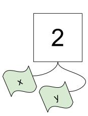

## Kontrollstrukturen

Komplexe Programme laufen nicht linear ab (also Zeile für Zeile vom Anfang eines Scripts bis zum Ende), sondern beinhalten Verzweigungen und Schleifen. Diese sogenannten Kontrollstrukturen steuern den Programmfluss. Wesentlich dabei sind Vergleiche, die bestimmen, ob bestimmte Codezeilen ausgeführt werden oder nicht bzw. wie oft diese wiederholt werden.


## Vergleiche

Vergleiche sind logische Ausdrücke – ihr Ergebnis ist entweder wahr (`True`) oder falsch (`False`). In Python gibt es dafür den Datentyp `bool`. Folgende Vergleichsoperationen sind möglich:

* Gleichheit: `==`
* Ungleichheit: `!=`
* Kleiner: `<`
* Kleiner gleich: `<=`
* Größer: `>`
* Größer gleich: `>=`

Man kann mehrere logische Ausdrücke mit den folgenden Operatoren verknüpfen:

* Und-Verknüpfung: `and`
* Oder-Verknüpfung: `or`

Ein Ausdruck kann mit dem Operator `not` logisch invertiert werden (d.h. aus `True` wird `False` und aus `False` wird `True`). Weiters gibt es noch folgende Operatoren:

* `is`: Identität (prüft, ob es sich um ein und dasselbe *Objekt* handelt, nicht nur um gleiche *Werte*)
* `in`: Prüft, ob ein Wert in einer Sequenz enthalten ist

Während `==` zwei *Werte* miteinander vergleicht, überprüft `is` zwei *Objekte* auf Gleichheit (also ob es sich um ein und dasselbe Objekt handelt).


### Beispiele

```{python}
x = 2  # Zuweisung
```

```{python}
x == 2  # Vergleich
```

```{python}
x > 2
```

```{python}
x < 10 and x > 5
```

Die vorige `and`-Verknüpfung von zwei Vergleichen kann in Python kürzer dargestellt werden:

```{python}
5 < x < 10
```

```{python}
x < 10 or x > 5  # macht das Sinn?
```

```{python}
y = 2
```

```{python}
x == y  # Werte vergleichen
```

```{python}
x is y  # Objekte vergleichen
```

Wir können mit der Funktion `id` die IDs der Objekte `x` und `y` bestimmen:

```{python}
id(x)
```

```{python}
id(y)
```

Man erkennt, dass beide Objekte `x` und `y` dieselbe ID haben. Dies bedeutet, dass das zugrundeliegende Objekt `2` ein und dasselbe Objekt ist und lediglich zwei Namen `x` und `y` hat.



Die tatsächlichen IDs von Objekten sind ein Implementierungsdetail von Python, d.h. es ist nicht relevant, welche Zahl hier zurückgegeben wird. Dennoch kann man diese IDs verwenden, um zwei Objekte auf Gleichheit zu überprüfen, denn nur dann haben beide Objekte dieselbe ID.

Das folgende Beispiel veranschaulicht, dass es einen Unterschied zwischen Ganzzahlen (`int`) und Kommazahlen (`float`) gibt, obwohl deren Werte (zumindest mathematisch) gleich sein können.

```{python}
c = 12
d = 12.0
```

```{python}
c == d
```

```{python}
c is d
```

::: callout-tip
In Python kann man Dezimalzahlen auch in der sogenannten [wissenschaftlichen Notation](https://de.wikipedia.org/wiki/Wissenschaftliche_Notation) anschreiben. Hier verwendet man eine Darstellung mit Zehnerpotenzen, die man in Python mit `e` eingeben kann – `e` kann man als "mal zehn hoch" lesen.

```{python}
1e0  # 1 mal 10 hoch 0
```

```{python}
-4e0  # -4 mal 10 hoch 0
```

```{python}
1e1  # 1 mal 10 hoch 1
```

```{python}
3.5e2  # 3.5 mal 10 hoch 2
```

```{python}
1e-2  # 1 mal 10 hoch -2
```

```{python}
1e-15  # 1 mal 10 hoch -15 = 0.000000000000001
```
:::


## Bedingungen

Eine Bedingung wird in Python mit den Schlüsselwörtern `if`, `elif` und `else` realisiert. Dabei wird überprüft, ob ein Ausdruck wahr (`True`) oder falsch (`False`) ist. Nur falls dieser Ausdruck `True` ist, wird der nachfolgende eingerückte Codeblock ausgeführt, sonst nicht. Die grundsätzliche Struktur sieht wie folgt aus:

```python
if <statement is True>:
    <do something>
    ...
elif <statement is True>:  # optional
    <do something>
    ...
elif <statement is True>:  # optional
    <do something>
    ...
else:  # optional
    <do something>
    ...
```

Zuerst gibt es eine Kopfzeile, welche mit dem Schlüsselword `if` eingeleitet wird. Danach folgt ein logischer Ausdruck (meist ein Vergleich), und zum Schluss wird die Kopfzeile mit einem `:` abgeschlossen. Der darauf folgende eingerückte Code wird nur ausgeführt, wenn der logische Ausdruck `True` ergibt – wenn das nicht der Fall ist, wird der gesamte eingerückte Codeblock übersprungen.

Nur wenn der erste Ausdruck `True` ist, wird also der eingerückte Code ausgeführt. Danach wird der gesamte restliche `if`/`elif`/`else`-Block verlassen, es wird also kein weiterer Code mehr ausgeführt. Wenn der erste Ausdruck `False` ist, wird der zugehörige Codeblock nicht ausgeführt und es wird zum nächsten `elif`-Ausdruck gesprungen (falls vorhanden). Hier wird dann ein weiterer logischer Ausdruck ausgewertet, und falls dieser `True` ist, wird der dazugehörige eingerückte Codeblock ausgeführt. Falls kein logischer Ausdruck in den `elif`-Zweigen `True` ist, wird schließlich der Codeblock im `else`-Zweig ausgeführt (falls vorhanden).

::: callout-important
In einer Bedingung wird maximal *ein* Codeblock ausgeführt, nämlich der erste, dessen logischer Ausdruck `True` ergibt. Deshalb ist auch die Reihenfolge der einzelnen Zweige von Bedeutung.
:::


### Beispiele

Beginnen wir mit einem einfachen Beispiel, bei dem nur ein `if`-Zweig vorhanden ist:

```{python}
a = 2

if a > 0:
    print("a is a positive number")
    print("this is good to know")
```

Ergibt der Vergleich `a > 0` also `False`, wird der eingerückte Code *nicht* ausgeführt:

```{python}
a = -10

if a > 0:
    print("a is a positive number")
    print("this is good to know")
```

Man kann optional einen `else`-Zweig verwenden, der immer dann ausgeführt wird, wenn *alle* vorhergehenden Zweige `False` waren:

```{python}
a = 0

if a > 0:
    print("a is a positive number")
    print("this is good to know")
else:
    print("a is either 0 or a negative number")
```

Schließlich kann man noch mit `elif` beliebig viele weitere Zweige einbauen:

```{python}
a = 0

if a > 0:
    print("a is a positive number")
    print("this is good to know")
elif a < 0:
    print("a is a negative number")
else:
    print("a is 0")
```

Sobald ein Ausdruck in einem `if`-Block `True` ist, wird dieser ausgeführt und der gesamte Block wird verlassen. Es werden also keine weiteren Vergleiche mehr durchgeführt.

```{python}
x = 2

if x == 2:
    print("x is", x)
elif x > 0:
    print("x is greater than 0")
elif x < 0:
    print("x is negative")
else:
    print("x is 0")
```

Dementsprechend ist die Reihenfolge der einzelnen Zweige von Bedeutung:

```{python}
a = 4

if a > 5:
    print("One")
elif a < 10:
    print("Two")
elif a == 4:
    print("Three")
else:
    print("Four")
```

```{python}
a = 4

if a > 5:
    print("One")
elif a == 4:
    print("Three")
elif a < 10:
    print("Two")
else:
    print("Four")
```

Man kann Vergleiche nicht nur mit Zahlen durchführen, sondern auch z.B. mit Strings:

```{python}
s = "Python"

if s == "Python":
    print("Way to go!")
elif s == "R":
    print("Statistics")
else:
    print("Unknown")
```

```{python}
s = "R"

if s == "Python":
    print("Way to go!")
elif s == "R":
    print("Statistics")
else:
    print("Unknown")
```


## for-Schleifen

Um Befehle zu wiederholen, gibt es die Möglichkeit, Schleifen zu verwenden. Eine häufig verwendete Schleifenart ist die sogenannte `for`-Schleife. Als einfaches Beispiel ersetzen wir folgenden repetitiven Code durch eine Schleife:

```{python}
print("Hallo")
print("Hallo")
print("Hallo")
```

```{python}
for i in range(3):
    print("Hallo")
```

Die sogenannte Schleifenvariable `i` nimmt hier in den drei Durchläufen drei verschiedene Werte 0, 1 und 2 an – dies sind nämlich genau die Werte, die der Funktionsaufruf `range(3)` zurückgibt. Der Name der Schleifenvariable kann beliebig gewählt werden, oft wird für kurze Schleifen einfach `i` verwendet (man könnte auch `_` verwenden, um anzudeuten, dass man an diesem Namen eigentlich nicht weiter interessiert ist). Dieser Name bleibt nach dem Ausführen der Schleife übrigens bestehen, er unterscheidet sich nicht von anderen durch Zuweisung entstandenen Namen.

::: callout-tip
Überlegen Sie, welchen Wert `i` am Ende des folgenden Beispiels hat:

```python
i = 800
for i in range(3):
    print("Hello")
```

Die richtige Antwort lautet `2`, da dies der letzte Wert ist, der in der Schleife zugewiesen wird. Der Funktionsaufruf `range(3)` erzeugt nämlich die drei Werte `0`, `1` und `2`. Die Zuweisung `i = 800` zu Beginn hat hier überhaupt keinen Effekt. Anders ausgedrückt ist diese Zuweisung überflüssig und könnte ohne Auswirkungen entfernt werden, da die Schleife `i` unmittelbar danach nacheinander die Werte `0`, `1` und `2` zuweist.
:::

Die Funktion `range` wird mit `range(start, stop, step)` aufgerufen (der Hilfetext verrät dazu mehr Details) und erzeugt eine Sequenz, welche aus ganzen Zahlen besteht, die von `start` (optional) bis `stop` in der Schrittweite `step` (optional) läuft. Wenn man sich die einzelnen Elemente in einem `range`-Objekt ansehen will, muss man dieses zuerst in eine Liste umwandeln:

```{python}
x = range(10)
x
```

```{python}
list(x)
```

Grundsätzlich beginnt Python mit 0 zu zählen, d.h. auch `range` beginnt standardmäßig bei 0. Die letzte Zahl ist nicht mehr Teil der Sequenz, da man so einfach die Anzahl der erzeugten Elemente sehen kann (im Beispiel oben sieht man, dass `range(10)` aus 10 Elementen besteht).

In Python iteriert eine `for`-Schleife also eigentlich über alle Elemente einer Sequenz. Im folgenden Beispiel iteriert die Schleife über einen String, d.h. bei jedem Schleifendurchlauf werden die einzelnen Elemente (Buchstaben) eines Strings der Schleifenvariable `s` zugewiesen:

```{python}
for s in "String":
    print(s)
```

Dies funktioniert genauso mit Listen, da diese auch zur Gruppe der Sequenzdatentypen gehören und mehrere Elemente beinhalten können:

```{python}
a = ["Hello", "world!", "I", "love", "Python!"]

for element in a:
    print(element)
```

Der Befehl `break` bricht die Schleife vorzeitig ab. Python springt sofort ans Ende der Schleife und macht von hier mit der Ausführung der noch folgenden Befehlszeilen weiter.

```{python}
i = 0

for c in "Suchstring":
    if c == "u":
        break  # beende Schleife sofort
    i += 1  # Abkürzung für i = i + 1

print(i)
```

Im Beispiel oben wird ein bestimmtes Zeichen in einem String gesucht, dessen Position dann in `i` abzulesen ist.

Der Befehl `continue` geht sofort zur nächsten Iteration der Schleife (überspringt also den restlichen Code der Schleife, der noch danach folgt).

```{python}
for num in range(2, 10):
    if num % 2 == 0:  # gerade Zahl?
        print("Found an even number", num)
        continue  # überspringe alle restlichen Zeilen innerhalb der Schleife
    print("Found a number", num)
```

Details zu Strings und Listen folgen in den nächsten Einheiten.


## while-Schleifen

Im Gegensatz zu `for`-Schleifen sind `while`-Schleifen gut geeignet, wenn nicht im Vorhinein klar ist, wie oft die Schleife durchlaufen werden soll. Im folgenden Beispiel wird eine sogenannte *Endlosschleife* verwendet (`while True` ist immer `True`). Zum Verlassen dieser Endlosschleife wird dann aber auf `break` zurückgegriffen. Die Funktion `input` wird verwendet, um Tastatureingaben vom Benutzer abzufragen – die eingegebenen Zeichen werden von dieser Funktion als String zurückgegeben.

```python
while True:
    line = input("> (enter 'q' to quit) ")
    if line == "q":
        break
```

Ein weiteres Beispiel einer `while`-Schleife zeigt das folgende Zahlenratespiel:

```python
number = 23  # diese Zahl soll erraten werden

while True:
    guess = int(input("Enter an integer: "))
    if guess == number:
        print("Congratulations, you guessed it.")
        break
    elif guess < number:
        print("No, it is a little higher than that.")
    else:
        print("No, it is a little lower than that.")
```

::: callout-tip
Die Funktion `int` wird hier verwendet, um die Benutzereingabe (ein String) in eine Ganzzahl zu konvertieren (z.B. wandelt `int("7")` den String `"7"` in eine Zahl `7` um).
:::


## Übungen

### Übung 1

Schreiben Sie folgendes Programm:

- Lesen Sie zuerst mit der Funktion `input` zwei Zahlen ein (weisen Sie diesen beiden Zahlen die Namen `x` und `y` zu). Beachten Sie, dass `input` Strings zurückliefert und dass Sie diese mit der Funktion `int` in Ganzzahlen umwandeln können.
- Wenn die Summe der beiden Zahlen größer als 50 ist, geben Sie `x + y > 50` am Bildschirm aus.
- Wenn die Summe der beiden Zahlen kleiner als 50 ist, geben Sie `x + y < 50` am Bildschirm aus.
- Ansonsten geben Sie `x + y == 50` aus.

::: callout-tip
Die Builtin-Funktion `input` ermöglicht es, Eingaben von der Tastatur einzulesen. Man kann beliebige Zeichen eingeben und mit der Eingabetaste bestätigen. Das Ergebnis der Eingabe wird dann von der Funktion *zurückgegeben* (d.h. man kann diesem Wert auch einen Namen zuweisen, z.B. `x = input()`). Der Typ des Rückgabewerts ist immer `str`.
:::


### Übung 2

Gegeben ist eine Liste `lst = ["I", "love", "Python"]`. Schreiben Sie eine `for`-Schleife, welche die einzelnen Elemente in der Liste mit `print` Zeile für Zeile am Bildschirm ausgibt.


### Übung 3

Gegeben ist wieder eine Liste `lst = ["I", "love", "Python"]`. Schreiben Sie eine `for`-Schleife, welche über die einzelnen Elemente in der Liste iteriert. Eine zweite (geschachtelte) `for`-Schleife soll dann über jeden Buchstaben der einzelnen Strings iterieren und jeden Buchstaben einzeln gefolgt vom Zeichen `-` ausgeben.

::: callout-note
Verwenden Sie die Funktion `print` mit dem Argument `end="-"`. Die Ausgabe soll wie folgt aussehen:

```
I-l-o-v-e-P-y-t-h-o-n-
```
:::


### Übung 4

Schreiben Sie das folgende verschachtelte `if`–`else`-Konstrukt als `if`–`elif`–`else`-Block:

```python
if x > 0:
    print("x is positive")
else:
    if x < 0:
        print("x is negative")
    else:
        print("x is equal to 0")
```

Überprüfen Sie Ihre Lösung mit den drei Werten `x = 5`, `x = -11` und `x = 0` (d.h. bei beiden Varianten soll dasselbe Ergebnis herauskommen).


### Übung 5

Schreiben Sie ein Programm, welches die Eingabe einer ganzen Zahl zwischen 1 und 10 erwartet. Falls die Eingabe nicht im erlaubten Bereich liegt, soll eine Meldung ausgegeben werden ("Invalid input. Please try again.") und die Eingabe wiederholt werden. Falls die Eingabe im erlaubten Bereich liegt, soll die Schleife beendet werden und die eingegebene Zahl ausgegeben werden (z.B. "You entered: 5").


## Lösungen

Die Lösungen zu diesen Übungen finden Sie [hier](03-solutions.qmd).
