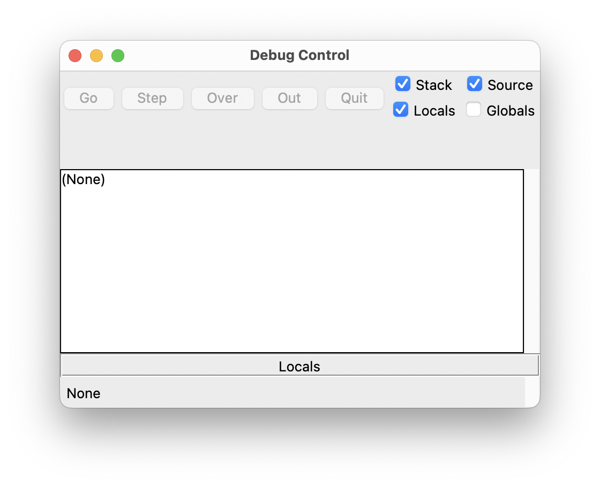
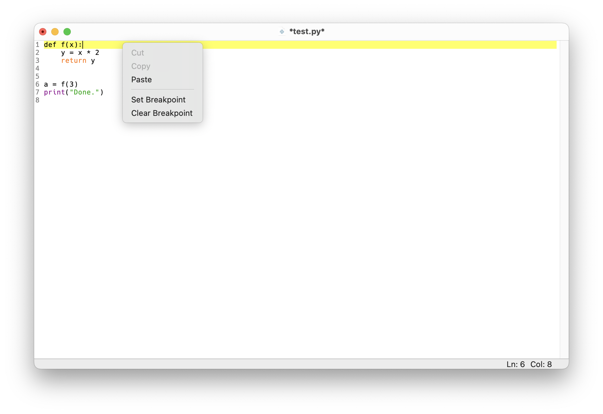

## Allgemeines

Funktionen kann man sich wie kleine Programme bzw. Skripte vorstellen. Sie fassen mehrere Anweisungen zu einem Block zusammen. Eine Funktion in Python lässt sich gut mit einer mathematischen Funktion vergleichen, zum Beispiel mit der Quadratfunktion $f(x) = x^2$. Diese berechnet aus einem gegebenen Wert $x$ einen neuen Wert $x^2$. Anschließend kann man die Funktion mit konkreten Werten für $x$ verwenden, um die entsprechenden Ergebnisse zu erhalten, z.B. $f(3) = 9$ oder $f(5) = 25$.

Auch in Python hat eine Funktion eine klar definierte Aufgabe. Funktionen dienen unter anderem dazu, Programmcode zu strukturieren und dadurch die Lesbarkeit zu erhöhen. Außerdem ermöglichen sie es, Code wiederzuverwenden. Das bedeutet, dass man eine einmal definierte Funktion beliebig oft aufrufen (verwenden) kann. Funktionen machen Programme häufig auch kürzer, weil sich wiederkehrende Anweisungen in einer Funktion bündeln lassen. Sollten später einmal Änderungen notwendig sein, muss man den Code nur an einer Stelle (in der Funktion) anpassen. Funktionen lassen sich auch in anderen Programmen wiederverwenden.

:::{.callout-note}
Einige Funktionen wie `print`, `type` und `math.sqrt` haben wir bereits in den vorigen Einheiten kennengelernt und verwendet.
:::


## Funktionen aufrufen

Eine Funktion *aufrufen* bedeutet, dass der in ihr enthaltene Code ausgeführt wird – die Funktion verrichtet also ihre Arbeit.

In Python ruft man eine Funktion mit ihrem Namen gefolgt von einem *Paar runder Klammern* auf. Innerhalb der Klammern werden die *Argumente* für die Funktion übergeben (falls notwendig). Mit Argumenten übergibt man der Funktion Werte, welche diese für die Ausführung benötigt. Beispielsweise benötigt die Funktion `type` ein Argument, denn sonst kann sie ihre Aufgabe nicht erfüllen – nämlich den Typ des übergebenen Arguments zu bestimmen. Gleichermaßen braucht auch die Funktion `math.sqrt` aus dem `math`-Modul ein Argument, damit diese die Wurzel der übergebenen Zahl berechnen kann.

Hier sind drei Beispiele für Aufrufe von bereits bekannten Funktionen mit jeweils einem Argument:

```{python}
print("Hello")
```

```{python}
type(3.14)
```

```{python}
import math
math.sqrt(16)
```

Es gibt aber auch Funktionen, die man *ohne* Argument aufrufen kann (der folgende Funktionsaufruf bewirkt eine Ausgabe einer Leerzeile am Bildschirm):

```{python}
print()
```

Wie viele Argumente eine Funktion tatsächlich benötigt, hängt ganz alleine von der jeweiligen Funktion ab (dies ist in ihrer Dokumentation nachzulesen).

:::{.callout-important}
Lässt man die Klammern weg, wird die Funktion *nicht* aufgerufen – es wird dann lediglich der Wert des Namens (also das Funktionsobjekt) angezeigt, wenn man Python im interaktiven Modus verwendet.

```{python}
print
```

Dabei handelt es sich um einen Namen, welcher auf ein Funktionsobjekt verweist:

```{python}
type(print)
```

Das Konzept von Namen in Python haben wir bereits kennengelernt. Es ist unerheblich, auf welches Objekt ein Name verweist, dies kann eine Ganzzahl, eine Funktion, oder jedes beliebige andere Objekt sein. So können wir z.B. auch den Namen `f` erstellen, welcher auf die Funktion `print` verweist:

```{python}
f = print
```

Nun hat die Funktion zwei Namen, nämlich `print` und `f`:

```{python}
f("Hello via f")
```
:::


## Funktionen definieren

Wir sind glücklicherweise nicht auf bereits existierende Funktionen beschränkt, sondern können selbst unsere eigenen Funktionen schreiben. In Python wird eine Funktion wie folgt *definiert* (die Zeilen in spitzen Klammern sind Pseudo-Code und müssen durch konkrete Befehle ersetzt werden):

```python
def function_name(parameter1, parameter2, ...):
    <do something>
    <...>
    <optionally return something>
```

Eine Funktionsdefinition beginnt immer mit dem Schlüsselwort `def`. Danach folgt der (frei wählbare) Funktionsname (aber auch hier muss man sich an die Regeln für gültige Namen halten). Die PEP8-Konvention empfiehlt außerdem, dass Funktionsnamen keine Großbuchstaben enthalten sollten. Falls der Name aus mehreren Wörtern bestehen soll, sollten Unterstrichen zur Trennung verwendet werden, z.B.:

```python
def test_function
```

Nach dem Funktionsnamen folgt ein Paar runder Klammern. Innerhalb dieser werden von der Funktion benötigte *Parameter* aufgelistet (mehrere Parameter werden durch Kommas voneinander getrennt). Parameter sind Platzhalter, welche beim Ausführen der Funktion mit spezifischen Werten ersetzt werden. Diese spezifischen Werte (auch *Argumente* genannt) werden bei jedem Aufruf übergeben. Es gibt aber auch Funktionen, die *keine* Parameter haben – die beiden runden Klammern müssen aber trotzdem immer vorhanden sein:

```python
def test_function()  # ohne Parameter
```

Falls eine Funktion zwei Parameter haben soll, würde man dies wie folgt anschreiben:

```python
def test_function(n, v)  # zwei Parameter namens n und v
```

Unabhängig von der Anzahl der Parameter schließt ein Doppelpunkt den sogenannten *Funktionskopf* ab:

```python
def test_function(n, v):
```

Nun folgt der Code, welcher von der Funktion ausgeführt wird, wenn diese aufgerufen wird – dieser Code muss um eine Ebene *eingerückt* werden (also vier Leerzeichen). Man spricht hier vom sogenannten *Funktionskörper*. Im Funktionskörper kann man insbesondere alle Parameter wie normale Namen verwenden – diese sind nur innerhalb der Funktion vorhanden und erhalten dann die konkreten Werte der Argumente, welche beim Funktionsaufruf übergeben wurden.

:::{.callout-important}
Eine Funktion kann *Parameter* haben, welche bei der *Definition* aufgelistet werden müssen. Wenn man die Funktion aufruft, muss man für alle Parameter konkrete Werte übergeben – diese konkreten Werte nennt man *Argumente*.
:::

Das folgende Beispiel definiert eine Funktion namens `test_function`, welche aus zwei Zeilen Code im Funktionskörper besteht:

```{python}
def test_function():
    s = "Hello world!"
    print(s)
```

Man beachte, dass die Funktion hier lediglich definiert wurde, d.h. sie wurde noch *nicht* ausgeführt. Sie ist aber dem Python-Interpreter ab jetzt bekannt (d.h. es existiert ein Name `test_function`, welcher auf ein Funktionsobjekt verweist):

```{python}
test_function
```

```{python}
type(test_function)
```

Aufgerufen kann unsere Funktion nun wie folgt werden (die runden Klammern sind essentiell):

```{python}
test_function()
```

Wir können eine bereits definierte Funktion beliebig oft aufrufen.

```{python}
test_function()
```

Im Fall einer Funktion mit Parametern würden die Definition und der Aufruf z.B. so aussehen:

```{python}
def test_function_2(n, v):  # Definition, zwei Parameter
    if v:
        print(n)
```

```{python}
test_function_2("Hello world!", True)  # Aufruf mit zwei konkreten Argumenten
```

```{python}
test_function_2("Hi!", False)  # weiterer Aufruf mit anderen Argumenten
```

Übergibt man beim Aufruf dieser Funktion nicht genau die erwartete Anzahl an Argumenten, bekommt man einen Fehler:

```{python}
#| error: true
test_function_2()  # zwei Argumente erwartet, aber keine übergeben!
```

:::{.callout-important}
Alle in der Funktionsdefinition definierten Parameter müssen beim Aufrufen der Funktion mit konkreten Argumenten befüllt werden!
:::

:::{.callout-tip}
Es ist üblich, gleich in der ersten Zeile des Funktionskörpers eine kurze Beschreibung der Funktion in einem sogenannten *Docstring* anzugeben (dieser kann sich auch über mehr als eine Zeile erstrecken). Ein Docstring wird von jeweils drei Anführungszeichen `"""` umschlossen. Das Vorhandensein eines Docstrings ändert nichts an der Funktionsweise, dient aber der Dokumentation und gehört zum guten Coding-Stil dazu, wie folgendes Beispiel demonstriert:

```{python}
def test_function():
    """Print hello world."""
    s = "Hello world!"
    print(s)
```

Ein solcher Docstring ist übrigens kein Kommentar! Verwenden Sie für Kommentare also weiterhin das `#`-Zeichen!
:::


## Rückgabewerte

Funktionen können Werte (Ergebnisse) *zurückgeben*. In beiden soeben definierten Funktionen `test_function` und `test_function_2` wird allerdings *kein* Wert explizit zurückgegeben (d.h. die Funktionen führen nur Code aus und geben implizit `None` zurück, der spezielle Wert für "nichts" in Python). Diese beiden Funktionsaufrufe können also nicht auf einen Wert reduziert werden – sie sind also keine Ausdrücke.

Wenn eine Funktion explizit einen Wert (ein Ergebnis) zurückgeben soll, verwendet man dazu das Schlüsselwort `return`, gefolgt vom gewünschten Rückgabewert:

```{python}
def add_one(number):
    """Increment a given number by one."""
    return number + 1
```

Beim Aufrufen der Funktion wird ihr Code im Funktionskörper ausgeführt, bis die Zeile mit `return` erreicht wird. Diese bewirkt, dass die Funktion sofort verlassen und der angegebene Wert `number + 1` zurückgegeben wird (hier wird für `number` natürlich der als Argument übergebene konkrete Wert verwendet). Sollten also nach dem `return`-Befehl noch weitere Zeilen Code im Funktionskörper folgen, werden diese nicht mehr ausgeführt.

```{python}
add_one(5)
```

Ein Funktionsaufruf wird also immer auf seinen Rückgabewert reduziert. Ein Aufruf einer Funktion, die einen Wert zurückgibt, ist also ein Ausdruck. Nun könnte man diesem auch einen Namen geben:

```{python}
x = add_one(9)
```

```{python}
x
```

Man kann den Wert einer Funktion (also den Rückgabewert) auch explizit mit Hilfe der `print`-Funktion am Bildschirm ausgeben:

```{python}
print(add_one(122))
```

:::{.callout-tip}
Man kann überall dort, wo man einen Wert angeben kann, auch einen Ausdruck (eine beliebige Kombination aus Werten und Operatoren) einsetzen – eben auch einen Funktionsaufruf, der einen Wert zurückgibt. Dies wird als *Komposition* bezeichnet. Die Werte werden der Reihe nach (von *innen* nach *außen*) verarbeitet und eingesetzt, bis zum Schluss ein einziger Wert übrig bleibt:

```{python}
add_one(add_one(add_one(1)))
```
:::


## Debugging

Mit Hilfe des sogenannten [Debuggers](https://realpython.com/python-idle/#how-to-debug-in-idle) können wir ein Script in "Zeitlupe" ausführen. Im Debug-Modus wartet der Python-Interpreter nach jedem Befehl, bis der nächste manuell gestartet wird. Dadurch können wir den Programmfluss beobachten und den Zustand des Programms bei jedem Schritt inspizieren. Dabei geht man wie folgt vor:

1. In der IDLE-Shell wählt man Debug – Debugger. Dadurch wird ein neues Werkzeugfenster geöffnet und der Debugger aktiviert. Stellen Sie sicher, dass das Kontrollkästchen "Source" aktiviert ist, um die aktuelle Codezeile zu sehen.

    {width=50%}

2. Setzen Sie dann einen Haltepunkt im Python-Skript, indem Sie mit der rechten Maustaste auf die Zeile klicken, an der Sie die Ausführung stoppen möchten und wählen Sie "Set Breakpoint". Für dieses Beispiel setzen wir einen Haltepunkt gleich in der ersten Zeile (diese wird dann gelb).

    

3. Führen Sie jetzt das Skript mit Run – Run Module aus (oder drücken Sie <kbd>F5</kbd>). Das Skript wird dann am ersten Haltepunkt gestoppt (und diese Zeile wird noch *nicht* ausgeführt).

4. Um die Ausführung fortzusetzen, wählen Sie "Step", um die aktuelle Zeile auszuführen und in der nächsten Zeile anzuhalten. Wenn die aktuelle Zeile einen Funktionsaufruf enthält und Sie *nicht* in die Funktion springen möchten (zum Beispiel, weil Sie nicht daran interessiert sind, den Code einer eingebauten Funktion zu sehen), klicken Sie stattdessen auf "Over".

5. Wenn sich die aktuelle Zeile bereits in einer Funktion befindet und Sie diese Funktion sofort verlassen möchten, klicken Sie auf "Out".

Zum Ausprobieren kann man das folgende kurze Script debuggen:

```{python}
#| eval: false
#| code-line-numbers: true
def f(x):
    y = x * 2
    return y

a = f(3)
print("Done.")
```

In welcher Reihenfolge werden die Code-Zeilen ausgeführt?

Alternativ kann die Website [PythonTutor](http://pythontutor.com/visualize.html#mode=edit) den Programmfluss ebenfalls Schritt für Schritt darstellen. Dazu kopiert man einfach den gesamten Code in das Eingabefeld und klickt auf "Visualize Execution". So kann man durch wiederholtes Klicken auf "Next" nachvollziehen, wie Python den Code ausführt.


## Übungen

### Übung 1

Suchen Sie sich aus der Liste der eingebauten Funktionen (siehe Einheit 2) drei beliebige Funktionen aus.

- Rufen Sie den Hilfetext zu jeder Funktion auf und lesen Sie diesen durch, um herauszufinden was die Funktion tut.
- Rufen Sie die drei Funktionen mit geeigneten Argumenten auf.
- Geben Sie für jede Funktion an, ob diese einen Wert zurückgibt oder nicht. Falls ein Wert zurückgegeben wird, geben Sie diesen Wert sowie dessen Typ an!


### Übung 2

Schreiben Sie eine Funktion `mult`, welche zwei Zahlen multipliziert und deren Produkt *zurückgibt*. Die beiden Zahlen sollen als Argumente übergeben werden können. Rufen Sie Ihre Funktion mit ein paar Wertepaaren auf und stellen Sie sicher, dass Ihre Funktion wie gewünscht funktioniert. Die Funktion soll das Ergebnis als Wert zurückgeben, d.h. verwenden Sie innerhalb der Funktion nicht `print`, sondern `return`!


### Übung 3

Schreiben Sie eine Funktion `to_fahrenheit`, welche einen Parameter `celsius` hat und diese Celsius-Temperatur in Fahrenheit umwandelt und *zurückgibt*. Zum Testen rufen Sie Ihre Funktion mit den Celsius-Temperaturen 0, 20, 38 und 100 auf.

Schreiben Sie außerdem eine Funktion `to_celsius` (mit entsprechendem Parameter `fahrenheit`) und wandeln Sie die vier Fahrenheit-Temperaturen, die Sie vorher beim Aufruf der Funktion `to_fahrenheit` erhalten haben, wieder in Celsius-Temperaturen um!


### Übung 4

Nennen Sie Gründe, warum man Funktionen verwendet. Erklären Sie auch kurz den Unterschied zwischen Funktionsdefinition und Funktionsaufruf! Was ist der Unterschied zwischen Parametern und Argumenten?


### Übung 5

Schreiben Sie eine Funktion `is_odd`, welche einen Parameter hat und überprüft, ob das übergebene Argument gerade oder ungerade ist (das können Sie z.B. durch den Rest der Division durch 2 überprüfen). Falls das Argument ungerade ist, soll die Funktion `True` mittels `return` zurückgeben, sonst `False`.


## Lösungen

Siehe [hier](04-solutions.qmd).
