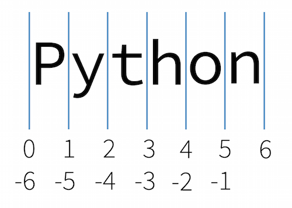

## Datentypen im Überblick

Die Datentypen in Python können grob in folgende Kategorien unterteilt werden:

- Logischer Datentyp (`bool`)
- Numerische Datentypen (`int`, `float`)
- Sequenzen (bestehen aus mehreren Elementen) (`str`, `list`, `tuple`)
- Mappings (Wertepaare) (`dict`)

Den logischen und die numerischen Datentypen sind wir bereits begegnet. In dieser Einheit lernen wir die *Sammlungstypen* `list`, `tuple` und `dict` kennen, mit denen man mehrere Objekte in einem einzigen Objekt zusammenfasst. Den Sequenzdatentyp `str` (String) behandeln wir dann in der nächsten Einheit im Detail.

Eine wichtige Eigenschaft von Datentypen ist, ob sie *mutable* (veränderbar) oder *immutable* (nicht veränderbar) sind. Objekte eines *mutable* Typs können auch nach ihrer Erstellung noch verändert werden, Objekte eines *immutable* Typs hingegen nicht:

- Mutable (veränderbar): `list`, `dict`
- Immutable (nicht veränderbar): `int`, `float`, `str`, `tuple`

Diese Unterscheidung wird uns im Verlauf der Einheit immer wieder begegnen.


## Listen erstellen

Eine Liste (`list`) ist ein Sequenzdatentyp, kann also aus mehreren Elementen bestehen. Im Gegensatz zu einem Text (String) kann eine Liste Elemente mit *unterschiedlichen* und *beliebigen* Datentypen enthalten, z.B. Strings, Zahlen, weitere Listen, und so weiter. Eine Liste erstellt man mit eckigen Klammern, innerhalb derer die einzelnen Elemente durch Kommas getrennt angegeben werden:

```{python}
x = [23, "Hallo", "test", 1.44, True]
```

```{python}
y = [1, "1", [1, 2, 3], ["test", False, [True, True, 2, 4]]]
```


## Indizieren und Slicen

Auf einzelne Elemente einer Liste greift man durch *Indizieren* zu. Den Index (also die Position des gewünschten Elements) gibt man dabei nach dem Objekt in eckigen Klammern an.

:::{.callout-important}
Python beginnt mit 0 zu zählen, d.h. das erste Element hat den Index 0. Den Index kann man daher als Unterschied/Abstand zum ersten Element interpretieren.
:::

```{python}
x[0]  # erstes Element
```

```{python}
x[1]  # zweites Element
```

Mit negativen Indizes kann man Elemente von hinten nach vorne ansprechen, d.h. −1 ist das letzte Element, −2 das vorletzte, usw.

```{python}
x[-1]  # letztes Element
```

```{python}
x[-2]  # vorletztes Element
```

Man kann auch mehrere Elemente auf einmal herausgreifen. Dazu schreibt man in die eckigen Klammern den Startindex, einen Doppelpunkt, und den Endindex. Wenn man auf diese Art (also unter Verwendung des Doppelpunkts) mehrere Elemente herausgreift, spricht man von einem *Slice*.

:::{.callout-important}
Der Endindex zählt _nicht_ mehr zum Bereich dazu!
:::

:::{.callout-note}
Gibt man den ersten Index nicht an, wird vom ersten Element (inklusive) gezählt. Gibt man den Endindex nicht an, wird bis zum letzten Element (inklusive) gezählt.
:::

```{python}
x[1:4]  # 3 Elemente, Index 1, 2, 3
```

```{python}
x[:2]  # die ersten 2 Elemente
```

```{python}
x[2:]  # ab Index 2 bis zum letzten Element
```

:::{.callout-tip}
Die Tatsache, dass der Startindex immer inklusive und der Endindex immer exklusive ist, hat den Vorteil, dass man sich durch die Differenz der beiden Indizes sofort die Anzahl der Elemente im Slice ausrechnen kann. Beispielsweise erkennt man so, dass `x[73:81]` genau $81 - 73 = 8$ Elemente enthält.
:::

Man kann optional nach dem Endindex noch einen weiteren Doppelpunkt gefolgt von der Schrittweite angeben (standardmäßig ist diese Schrittweite 1). So kann man z.B. jedes zweite Element herausgreifen:

```{python}
x[::2]
```

Wenn man die Reihenfolge der Elemente umdrehen möchte, gibt man als Schrittweite −1 an:

```{python}
x[::-1]  # Liste in umgekehrter Reihenfolge
```

Man kann sich die Indizes als Grenzen _zwischen_ den Elementen vorstellen:



:::{.callout-note}
Indizieren und Slicen funktionieren bei *allen* Sequenzdatentypen auf dieselbe Weise – also auch bei Strings, die wir in der nächsten Einheit behandeln.
:::


## Arbeiten mit Listen

### Länge

Die Funktion `len` gibt die Länge der Liste (also die Anzahl der Elemente in der Liste) zurück. Sehen wir uns noch einmal die beiden oben definierten Listen `x` und `y` an:

```{python}
x
```

```{python}
y
```

Diese enthalten 5 bzw. 4 Elemente:

```{python}
len(x)
```

```{python}
len(y)
```

In der Liste `y` sind das dritte und vierte Element selbst wieder Listen:

```{python}
y[2]
```

```{python}
y[3]
```

Letztere enthält eine weitere Liste am Ende (mit Index `2`):

```{python}
y[3][2]
```

Eine leere Liste ist eine ganz normale Liste, nur eben mit keinen Elementen (also mit einer Länge 0):

```{python}
z = []
len(z)
```

```{python}
type(z)
```


### Elemente verändern

Nachdem Listen *mutable* sind, kann man einzelne Elemente auch nach der Erstellung der Liste ändern.

```{python}
x
```

```{python}
x[1] = 111111
x
```

```{python}
x[0] = None
x
```


### Operatoren `+` und `* `

Zwei oder mehr Listen kann man mit dem `+`-Operator zu einer neuen Liste zusammenfügen:

```{python}
[1, 2, "drei"] + ["vier", 5, 6.0]
```

Der `*`-Operator vervielfältigt eine Liste:

```{python}
[1, 2.0, "drei"] * 3
```


### Elemente zu Listen hinzufügen

Mit der Methode `append` kann man neue Elemente am Ende der Liste hinzufügen.

```{python}
x
```

```{python}
x.append(13)
x
```

Weil Listen mutable sind, wird hier die Liste *direkt verändert*; eine erneute Zuweisung zu einem Namen ist nicht notwendig bzw. führt nicht zum gewünschten Ergebnis, was im folgenden Beispiel ersichtlich ist:

```{python}
a = x.append(25)
```

```{python}
print(a)  # Listen-Methoden geben None zurück, da Sie die Liste direkt ändern
```

```{python}
x  # geänderte Liste
```

:::{.callout-important}
Listen-Methoden *verändern* die Liste *direkt* (in-place) und geben *nichts* (`None`) zurück. Dies steht im Gegensatz zu immutable Typen wie Strings, deren Methoden das Objekt nicht verändern können und daher immer ein neues Objekt zurückgeben (mehr dazu in der nächsten Einheit).
:::

Möchte man gleich mehrere Elemente hinzufügen, kann man die Methode `extend` benutzen:

```{python}
x.extend([99, "HH", "zz"])
x
```

:::{.callout-tip}
Versuchen Sie anhand der folgenden zwei Befehle den Unterschied zwischen `append` und `extend` zu erklären:

```python
x.extend([99, "HH", "zz"])
x.append([99, "HH", "zz"])
```
:::


### Elemente aus Listen entfernen

Um bestimmte Elemente aus der Liste zu entfernen, verwendet man den `del`-Befehl.

```{python}
x = ["A", "b", 3, 4, "fünf"]
del x[1]  # löscht das Element mit dem Index 1
x
```

:::{.callout-note}
Beachten Sie, dass `del` ein Python-Keyword ist und keine Funktion. Daher handelt es sich bei `del x[1]` auch nicht um einen Funktionsaufruf, Klammern als Aufrufoperator sind also nicht notwendig!
:::

Alternativ kann man auch die Methode `pop` zum Löschen eines Elementes an einem bestimmten Index verwenden. Diese gibt das entfernte Element auch zurück (was `del` nicht tut).

```{python}
x = ["A", "b", 3, 4, "fünf"]
x.pop(1)
```

```{python}
x
```

Die Methode `remove` entfernt das erste Element aus der Liste, welches dem gesuchten Wert entspricht. Hier gibt man also nicht den zu entfernenden Index an, sondern den zu löschenden Wert.

```{python}
x = ["A", "b", 31, 41, "fünf"]
x.remove(31)
x
```


### Listen sortieren

Wenn eine Liste sortierbare Elemente enthält (z.B. lauter Zahlen), kann man sie mit der Methode `sort` sortieren.

```{python}
h = [6, 9, 23, 1, -78, 44]
h.sort()
h
```

:::{.callout-tip}
Was passiert, wenn man eine Liste mit nicht sortierbaren Elementen sortieren möchte (z.B. die Liste `x` aus dem vorigen Beispiel)?
:::


### Listen umkehren

Eine Liste kann man mit folgendem Slice umkehren (die ursprüngliche Liste ändert sich dabei aber nicht):

```{python}
h[::-1]
```

```{python}
h
```

Es gibt aber noch eine zweite Möglichkeit, welche die Liste direkt (in-place) verändert:

```{python}
h.reverse()
h
```


### Listen iterieren

Mit dem `in`-Operator kann man überprüfen, ob ein bestimmtes Element in einer Liste enthalten ist.

```{python}
2 in h
```

```{python}
-78 in h
```

Eine Liste ist wie jeder Sequenzdatentyp iterierbar, d.h. man kann mit einer `for`-Schleife über die einzelnen Elemente iterieren:

```{python}
for k in [2, "fünf", 3.14, "sieben"]:
    print(k)
```

Die Schleifenvariable `k` nimmt in jeder Iteration die einzelnen Werte der Liste an.


## Tupel

Tupel (englische Schreibweise *Tuple*) verhalten sich wie Listen, sind aber *immutable*. Das bedeutet, dass man die im Tupel enthaltenen Elemente nicht verändern kann. Tupel erstellt man wie Listen, nur lässt man die eckigen Klammern weg (man benötigt auch keine runden Klammern, obwohl diese manchmal in Kombination mit anderen Befehlen syntaktisch notwendig sind, z.B. wenn man ein Tupel als Argument übergeben möchte).

```{python}
t = "A", "b", 3, 4, "fünf"
t
```

```{python}
t[1]
```

```{python}
#| error: true
t[1] = "c"  # Fehler!
```

:::{.callout-tip}
Ein Tupel mit einem Element erstellt man mit einem nachgestellten Komma:

```{python}
t = "A",
t
```

Die Klammern sind, wie bereits erwähnt, optional:

```{python}
t = ("A",)
t
```
:::


## List Comprehensions

List Comprehensions sind eine alternative Möglichkeit zur Erstellung von Listen. List Comprehensions sind im Prinzip Schleifen, die aber syntaktisch wesentlich kompakter (kürzer) sind.

Nehmen wir als Beispiel eine Liste der Quadratzahlen von 0 bis 9. Mit einer normalen Schleife würde man diese Liste so erstellen:

```{python}
squares = []  # wir beginnen mit einer leeren Liste
for x in range(10):
    squares.append(x**2)  # Liste wird befüllt

squares
```

:::{.callout-note}
Bei der Erstellung von vielen Listen startet man mit einer leeren Liste und fügt dann mit einer Schleife die einzelnen Elemente zur Liste hinzu.
:::

Dasselbe Ergebnis kann mit einer List Comprehension viel kürzer geschrieben werden:

```{python}
squares = [x**2 for x in range(10)]
squares
```

Die Zutaten einer List Comprehension sind:

- Zwei umschließende eckige Klammern (die ja eine Liste definieren)
- Ein Ausdruck (`x**2` im Beispiel)
- Eine `for`-Anweisung (`for x in range(10)` im Beispiel)
- Optional eine `if`-Bedingung

Weitere Beispiele veranschaulichen, dass List Comprehensions eine Operation auf alle Elemente einer Liste anwenden oder bestimmte Elemente herausfiltern können:

```{python}
vec = [-4, -2, 0, 2, 4]
```

```{python}
[x * 2 for x in vec]  # neue Liste mit verdoppelten Einträgen
```

```{python}
[x for x in vec if x >= 0]  # negative Einträge herausfiltern
```

```{python}
[abs(x) for x in vec]  # eine Funktion auf alle Elemente separat anwenden
```

:::{.callout-note}
In Python ist es mit Listen also nicht einfach möglich, elementweise Berechnungen durchzuführen.

```{python}
x = [4, -3, 7, 81, 11]
x * 2
```

So werden die einzelnen Elemente nicht mit 2 multipliziert, sondern die Liste wird "verdoppelt". Immer dann, wenn man eine Operation elementweise anwenden möchte, muss man daher eine List Comprehension (oder die entsprechende Schleife) verwenden.

Für numerische Anwendungen ist das aber denkbar unpraktisch. Wir werden in einer der folgenden Einheiten lernen, wie man Python dennoch für numerische Berechnungen verwenden kann (nämlich dank eines neuen Datentyps namens NumPy Array, welches vom Zusatzpaket NumPy zur Verfügung gestellt wird).
:::

In der Praxis verwendet man List Comprehensions, so lange diese noch relativ einfach und übersichtlich sind. Hat man aber mehrere geschachtelte Schleifen und Bedingungen, verwendet man besser explizite Schleifen, da diese dann besser lesbar sind.


## Dictionaries

Der Datentyp Dictionary ist ein sogenannter Mapping-Datentyp. Man kann sich ein Dictionary wie ein Sprachwörterbuch vorstellen (daher auch der Name). Wenn man die Übersetzung zu einem bestimmten Wort wissen möchte, schlägt man unter dem gesuchten Wort (hier Key genannt) nach und findet dort die Übersetzung (hier als Value bezeichnet). In Python definiert man ein `dict` mit geschwungenen Klammern und trennt die Einträge wie bei Listen mit Kommas. Jeder Eintrag besteht aus einem Key und einem Value, welche durch einen Doppelpunkt voneinander getrennt sind.

Folgendes Beispiel zeigt ein `dict` mit drei Einträgen:

```{python}
d = {"Haus": "house", "Schlange": "snake", "Katze": "cat"}
```

Alternativ kann man auch die `dict`-Funktion benutzen. Mit Keyword-Argumenten kann man so das Dictionary initialisieren:

```{python}
d = dict(Haus="house", Schlange="snake", Katze="cat")
```

:::{.callout-note}
Man beachte, dass die Keys den Keyword-Argumenten entsprechen und dementsprechend ohne Anführungszeichen geschrieben werden müssen. Diese werden dann aber in Strings umgewandelt und so als Keys im Dictionary verwendet.
:::

Einzelne Elemente kann man wieder mit Indizierung herausgreifen – anstelle eines numerischen Index (wie bei Listen) gibt man aber nun den jeweiligen Key als Index an:

```{python}
d["Haus"]
```

```{python}
d["Schlange"]
```

:::{.callout-important}
Ein Dictionary ist also gewissermaßen eine verallgemeinerte Liste. Ein wichtiger Unterschied zu Listen ist, dass die Reihenfolge der Einträge in Dictionaries keine Rolle spielt. D.h. man kann bei einem Dictionary *nicht* vom ersten, zweiten, dritten Element usw. sprechen – bei Listen hingegen schon.
:::

Genau wie in Listen kann man in Dictionaries Elemente mit unterschiedlichen Datentypen speichern. Eine Einschränkung gibt es aber für die Keys: diese müssen *immutable* sein (daher kann man z.B. keine Listen als Keys verwenden). Neue Elemente fügt man einfach durch Angabe von Key und Value zu einem bestehenden Dictionary hinzu.

```{python}
d
```

```{python}
d[23] = "tt"  # Key 23, Value "tt"
d[1] = 3.14  # Key 1, Value 3.14
d["L"] = [1, 2, 3]  # Key "L", Value [1, 2, 3]
d
```

Möchte man auf einen Eintrag mit einem Key zugreifen, der im Wörterbuch nicht existiert, erhält man eine Fehlermeldung.

```{python}
#| error: true
d[0]  # Fehler!
```


### Arbeiten mit Dictionaries

Die Länge eines Dictionaries, also die Anzahl der Einträge, bestimmt man mit der Funktion `len`:

```{python}
len(d)
```

Die Keys bekommt man mit der Methode `keys`, die Values mit der Methode `values` (beides sind im Prinzip Listen):

```{python}
d.keys()
```

```{python}
d.values()
```

Ob ein Wert als Key vorkommt, kann man mit `in` überprüfen:

```{python}
"Katze" in d
```

```{python}
"cat" in d
```

Wenn man wissen möchte, ob ein Wert als Value vorkommt, verwendet man die `values`-Methode:

```{python}
"cat" in d.values()
```

Selbstverständlich kann man über ein Dictionary auch iterieren – in diesem Fall wird über die Keys iteriert:

```{python}
for k in d:
    print(k)
```

Auf die entsprechenden Values greift man dann durch Indizieren zu:

```{python}
for k in d:
    print(k, ":", d[k])
```

Eleganter funktioniert das mit der Methode `items`. Diese erzeugt eine Liste von Tupeln, welche die Key/Value-Paare enthalten:

```python
d.items()
```

Damit kann man in einer Schleife sowohl auf die Keys als auch auf die Values zugreifen.

```{python}
for k, v in d.items():
    print(k, ":", v)
```

Die gleichzeitige Zuweisung von Werten an die Namen `k` und `v` bezeichnet man in Python als *Unpacking* – nachdem `d.items()` jeweils ein Tupel bestehend aus zwei Elementen erzeugt, kann man diesen zwei Elementen direkt zwei Namen zuweisen.

:::{.callout-tip}
Ein weiteres Beispiel für Unpacking ist das Vertauschen von zwei Werten. Zunächst kann man damit zwei (oder mehr) Namen gleichzeitig zuweisen:

```{python}
a, b = 15, 23
```

```{python}
a
```

```{python}
b
```

Da Python immer zuerst die rechte Seite einer Zuweisung auswertet, kann man mit diesem Muster auch zwei Werte vertauschen:

```{python}
a, b = b, a
```

```{python}
a
```

```{python}
b
```
:::

Möchte man den Fehler beim Zugriff auf einen nicht existierenden Key vermeiden, kann man stattdessen die Methode `get` verwenden. Diese Methode hat zwei Parameter, nämlich einen Key und einen Standardwert, der zurückgegeben wird, falls der angegebene Key im Dictionary nicht existiert:

```{python}
d
```

```{python}
#| error: true
d["psy"]  # Fehler, Key "psy" existiert nicht
```

```{python}
d.get("psy", 0)  # Key "psy" existiert nicht, also wird 0 zurückgegeben
```

```{python}
d.get("Schlange", "Tier")  # Key "Schlange" existiert
```

```{python}
d.get("snake", "Schlange")  # Key "snake" existiert nicht
```

:::{.callout-tip}
Gibt man für `get` keinen Standardwert an, wird `None` zurückgegeben, falls der Key nicht existiert:

```{python}
d.get("psy")
```
:::

Zu beachten ist, dass in den Fällen, wo Standardwerte zurückgegeben werden, diese Einträge nicht automatisch zum Dictionary hinzugefügt werden:

```{python}
d
```

Möchte man diese neuen Einträge gleich dem Dictionary hinzufügen, verwendet man die Methode `setdefault`:

```{python}
d.setdefault("X", 42)  # Key "X" existiert nicht
```

```{python}
d  # jetzt gibt es den Key "X"
```

```{python}
d.setdefault("X", 100)  # Key "X" existiert bereits
```

```{python}
d
```


## Übungen

### Übung 1

Schreiben Sie eine Funktion `histogram`, welche eine Liste mit Zahlen entgegennehmen und diese als vereinfachtes Histogramm am Bildschirm darstellen soll. Dieses Histogramm soll für jeden Wert eine Zeile ausgeben mit der entsprechenden Anzahl an Zeichen. Das Standardzeichen soll ein Stern (`*`) sein, aber dieses Zeichen soll mit einem Parameter namens `char` anpassbar sein. Beispiele für mögliche Funktionsaufrufe und deren Ergebnisse lauten:

```
>>> histogram([1, 8, 5, 17, 14, 9, 2])
*
********
*****
*****************
**************
*********
**
```

```
>>> histogram([1, 8, 5, 17, 2], char="-")
-
--------
-----
-----------------
--
```

:::{.callout-note}
Diese Funktion liefert keinen Wert zurück, sondern gibt das Histogramm (mit Hilfe der `print`-Funktion) am Bildschirm aus.
:::


### Übung 2

Schreiben Sie eine Funktion `sum_of_squares`, welche eine Liste mit Zahlen als Parameter entgegennimmt und die Quadratsumme dieser Zahlen (also eine einzige Zahl) zurückgibt.

:::{.callout-note}
Sie könnten in der Funktion z.B. zuerst eine Liste mit den quadrierten Zahlen erstellen, deren Elemente mit der Funktion `sum` addieren und das Ergebnis zurückgeben.
:::


### Übung 3

Erstellen Sie eine Liste mit den ganzen Zahlen von 1 bis 25 und weisen Sie dieser Liste den Namen `numbers` zu. Erstellen Sie dann fünf neue Listen, welche folgende Zahlen beinhalten (basierend auf `numbers`, die neuen Listen sollen wie angegeben benannt werden):

- Die Quadratzahlen `squares`.
- Die geraden Zahlen `evens`.
- Die ungeraden Zahlen `odds`.
- Die Wurzeln `roots`.
- Die natürlichen Logarithmen `logs`.

Verwenden Sie zur Erstellung der neuen Listen jeweils eine geeignete List Comprehension.

:::{.callout-note}
Für die letzten beiden Listen verwenden Sie am besten Funktionen aus dem Modul `math`.
:::


### Übung 4

Erstellen Sie ein Dictionary `a`, welches drei Einträge hat und Übersetzungen der Wörter "eins", "zwei" und "drei" auf Englisch beinhalten soll. Wie können Sie die Übersetzung von "zwei" dann aus `a` anzeigen lassen?


### Übung 5

Fügen Sie dem Dictionary `a` aus der vorigen Übung einen neuen Eintrag ("vier" – "four") hinzu und geben Sie das gesamte Dictionary am Bildschirm aus.


### Übung 6

Was passiert, wenn Sie im Dictionary `a` auf den nicht existierenden Key `"zehn"` zugreifen wollen? Welche zwei Alternativen gibt es, um für nicht existierende Keys einen Standardwert (z.B. `"undefiniert"`) zurückzugeben (und daher die Fehlermeldung zu vermeiden)? Was ist der Unterschied zwischen diesen beiden Möglichkeiten? Geben Sie in Ihrer Antwort auch den konkreten Code für die drei Zugriffsmöglichkeiten auf das Element `"zehn"` von `a` an!
